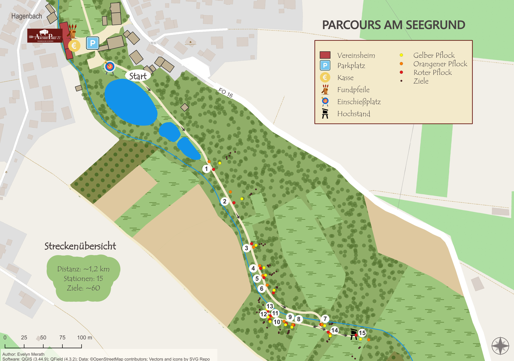

# Overview-Maps-of-Two-3D-Archery-Trails-with-QGIS

Creating overview maps for two 3D archery trails with QGIS and QField, from field data collection to cartographic design and terrain analysis.

---
## Introduction

The idea behind this project was to combine a hobby, practical use and cartography. Archery has been one of my passions for a long time. At the same time, I enjoy creating and designing maps. This combination gave me the idea to create overview maps for the two 3D archery trails of my club.

---
## Inspiration

A 3D archery trail is a designated route through natural surroundings where archers, particularly in traditional archery, shoot at life-sized animal targets made of plastic. The individual stations are integrated into the landscape and connected by a designated route.
For me, 3D archery is not only about the sport itself, but also about spending time outdoors in nature. The combination of concentration, calmness and movement makes it a particularly enjoyable experience.
Since 3D archery trails are often located in forests and on varied terrain, navigating between the individual stations can sometimes be challenging. An overview map can help to visualize the trail, the location of the stations and the surrounding terrain.
Until this project, the two trails of my club did not have their own maps. Since this project allowed me to combine my passion for archery with my interest in cartography and GIS, it seemed like the perfect opportunity to change that.
This project therefore brings together several things that I particularly enjoy: being outdoors, archery, creative work and the practical application of GIS.

---
## Workflow

First, I familiarized myself with the QField app on my smartphone and carried out several tests. Since the paths and stations of the trails had to be newly mapped, preparing the fieldwork was an important first step. The small signs and shooting pegs are barely visible on satellite imagery – especially in the forest. I therefore created a QGIS project specifically adapted to the conditions I would encounter in the field.
I created appropriate point and line layers that I could access later during fieldwork. Particularly useful were the Value Maps prepared for QField, which made data entry in the field much easier. For example, for the “Peg colour” field, I could simply choose between options such as “yellow”, “red” and “blue” instead of entering the values manually each time.
In the field, I recorded my route and mapped all relevant points. These included shooting pegs, targets and additional features such as rest areas. In some parts of the forest, the positioning became less accurate because the trees weakened the GPS signal.

Afterwards, I began processing the data in QGIS. I cleaned up the recorded paths and compared them with the existing paths in OpenStreetMap. I also added further relevant points, such as parking areas. For the different geometries, I developed suitable symbology and saved the styles as a template, allowing me to reuse the same symbols and styling for the second map.
For some important infrastructure features, I used additional symbols from SVG Repo. To avoid relying solely on the OpenStreetMap background, I also created simple polygons for forest areas, meadows and other land-use types. This allowed me to adapt the appearance of the map to my own preferences and create a more coherent overall design.
For the “Am Röthelfels” trail, I additionally used rule-based labeling. This allowed me to display the station numbers in different colours depending on the route, visually distinguishing the “red” and “blue” rounds.

For the final presentation, I created print layouts containing important map elements such as a legend, scale bar and additional text fields. Small arrows also indicate the direction of travel between the stations.

Another feature of the maps is the integration of basic terrain information, particularly route distance and elevation gain. The length of each route could be calculated directly in the attribute table using the Field Calculator. Calculating the elevation gain was somewhat more involved, as I did not want to show simply the elevation difference between the highest and lowest points. Instead, I wanted to calculate the total elevation gained along the trail.
For this purpose, I first downloaded the Digital Terrain Model (DGM1) provided by the Bavarian Surveying Administration and created an elevation profile along the respective trail. I then exported the profile data as a CSV file and analysed it in Excel. By calculating the elevation differences between consecutive points, excluding negative changes and summing the positive differences, I was able to determine the total elevation gain.

Since I also intend to make the maps publicly available through my club, I additionally looked into the licensing requirements of the datasets and materials used. Correctly documenting the relevant sources and licenses was an important part of the project to ensure that the maps can legally be published on the club's website.

---
## Results

The project resulted in two detailed overview maps for the 3D archery trails of my club. Both maps show the course layout, shooting stations, relevant infrastructure and basic terrain information such as route distance and elevation gain.

  
  

---
## Tools & Data

- **QGIS 3.44.9** – data processing, cartography and map layouts 
- **QField** – field data collection and GPS tracking 
- **OpenStreetMap** – reference data for paths and infrastructure 
- **DGM1** – digital terrain model provided by the Bavarian Surveying Administration 
- **Excel** – calculation of total elevation gain 
- **SVG Repo** – additional symbols

---
Once my club has integrated the maps into its website, a link will be added here:
